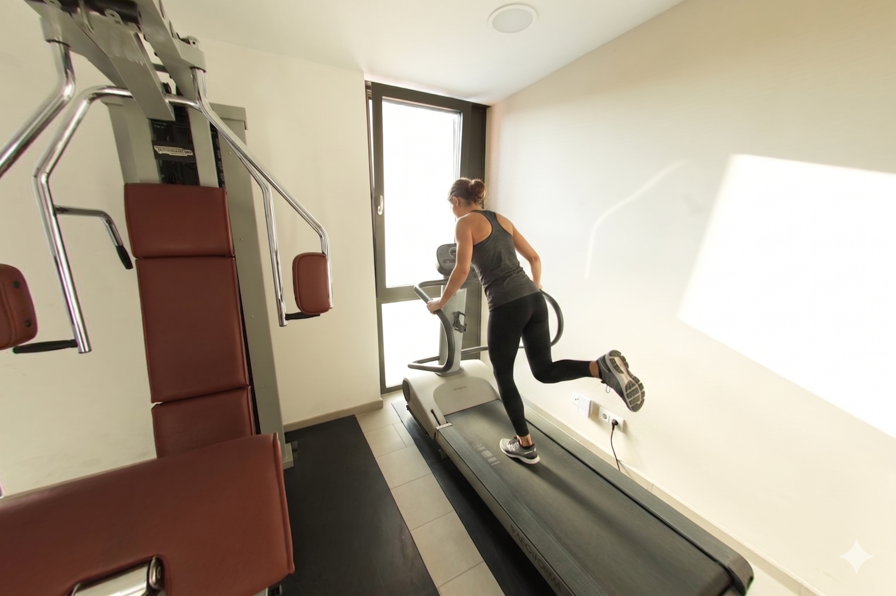
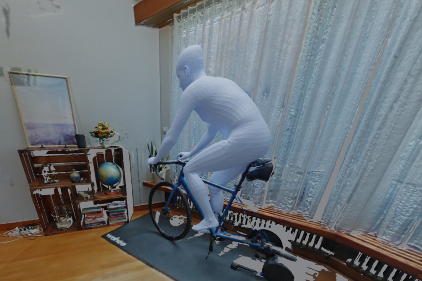
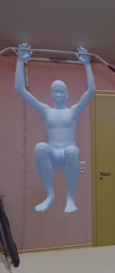

<div align="center">

# 4DHSI

### Foundation-Model-Guided Zero-Shot Synthesis of Human–Scene Interaction

Given a natural-language instruction, one calibrated RGB view, and a reconstructed 3D scene, 4DHSI places an SMPL-X human into the scene so that the correct body parts contact the correct surfaces.

**Muhammad Umer Abbasi · Technical University of Munich · 2026**


[Thesis PDF](https://github.com/mumerabbasi/4DHOI/blob/thesis/Thesis.pdf) · [Evaluation protocol](06_Evaluate_Interaction/EVALUATION_METRICS.md) · [Benchmark interactions](01_Generate_SIG/INTERACTIONS.md) · [Raw aggregate results](06_Evaluate_Interaction/ablation_metrics.csv)

</div>

> [!IMPORTANT]
> This `dev` branch contains the **static 3D human–scene interaction thesis system**. It produces one scene-grounded interaction state, not a temporal 4D sequence. This is distinct from the dynamic human–object pipeline on `main`.

The central idea is to treat **scene-side contact** as the bridge between foundation-model knowledge and metric 3D geometry. Instead of trusting a generated interaction image as the final answer, the system asks an image model to mark the precise object-surface region for each required body-part contact. A vision-language model verifies those regions and requests corrections before they are projected onto the scene mesh and used to optimize the body. Floor-support contacts follow a separate SAM 3 segmentation branch.

The complete pipeline is zero-shot with respect to 3D human–scene interaction: it does not train or fine-tune on paired 3D HSI data. It does use pretrained foundation models, monocular human recovery, calibrated camera geometry, and differentiable optimization.

## Example

<table>
  <tr>
    <th width="38%">1. Generated interaction hypothesis</th>
    <th width="24%">2. Verified scene contacts</th>
    <th width="38%">3. Scene-grounded SMPL-X result</th>
  </tr>
  <tr>
    <td></td>
    <td></td>
    <td></td>
  </tr>
</table>

<p align="center"><sub>Treadmill example: left hand, right hand, and left foot are localized separately on the two handles and belt, then grounded in the reconstructed scene.</sub></p>

## At a glance

| | |
|---|---|
| **Inputs** | Natural-language instruction, calibrated posed RGB view, reconstructed scene mesh |
| **Output** | One posed SMPL-X body in the scene's metric coordinate frame |
| **Core contribution** | Explicit per-body-part object-contact localization with an agentic verify-and-correct loop |
| **Geometric grounding** | Calibrated 2D-to-3D projection followed by contact- and collision-aware optimization |
| **Training regime** | No training or fine-tuning on paired 3D human–scene interaction data |
| **Evaluation** | 23 interactions, 82 required SIG contact edges, and 15 real ScanNet++ scenes |
| **Typical runtime** | Approximately 10 minutes per interaction on an NVIDIA RTX A6000, including API latency |

## Results

The method was evaluated on 23 varied interactions across 15 ScanNet++ scenes, including sitting, lifting, opening, reaching, climbing, hanging, stepping, and running. All geometric results below are unweighted means over interactions.

### Final 3D interaction quality

| Method | Mean contact distance ↓ | Mean penetration depth ↓ | CLIP ↑ | VLM contact ↑ | VLM mean ↑ |
|---|---:|---:|---:|---:|---:|
| PhySIC | 24.2 cm | 11 mm | 0.259 | 3.48 / 5 | 4.04 / 5 |
| GVHMR initialization | 16.3 cm | 17 mm | 0.270 | 2.87 / 5 | 3.75 / 5 |
| Single-shot contacts | 7.0 cm | **5 mm** | 0.271 | 3.83 / 5 | 4.27 / 5 |
| **Full method** | **3.9 cm** | **5 mm** | **0.272** | **4.00 / 5** | **4.36 / 5** |

Contact distance is the directed mean distance from a body-part contact region to its manually annotated scene region. Mean penetration depth is computed only over sampled scene points that penetrate the body, then averaged over interactions; it is not collision prevalence or volume. The aggregate CSV also reports the non-collision sample fraction separately.

Key takeaways:

- Agentic verification reduced final mean contact distance from **7.0 cm to 3.9 cm**, a **44.5% reduction** over otherwise identical single-shot contact localization.
- Scene-aware grounding reduced contact distance from **16.3 cm to 3.9 cm** and mean penetration depth from **17 mm to 5 mm** relative to the image-only GVHMR initialization.
- Under the thesis's cross-task comparison protocol, the full method achieved lower contact distance and mean penetration depth than PhySIC: **3.9 cm / 5 mm** versus **24.2 cm / 11 mm**.
- Semantic CLIP scores remained similar across settings, while contact-sensitive geometric and VLM measures separated them. This is expected: broad action recognition does not establish correct 3D contact.

### What the agentic loop changes

The contact stage was also evaluated directly in image space, before 3D optimization:

| Contact localization | Mask containment ↑ | Centroid error ↓ | Missed contacts ↓ |
|---|---:|---:|---:|
| Single shot | 0.60 | 27.6 px | 3 |
| **Agentic loop** | **0.74** | **19.5 px** | **0** |

The verify-and-correct loop eliminated all three observed missing contacts, increased containment by 0.14, and reduced centroid displacement by 8.1 pixels. A missing mask contributes zero containment but is excluded from the centroid mean, so misses are also reported explicitly.

The rounded tables above come from the checked-in [3D aggregate metrics](06_Evaluate_Interaction/ablation_metrics.csv) and [2D contact-mask metrics](06_Evaluate_Interaction/output_contact_masks/contact_mask_metrics.csv). See [EVALUATION_METRICS.md](06_Evaluate_Interaction/EVALUATION_METRICS.md) for exact definitions and interpretation.

### Qualitative findings

Across the final 3D gallery spanning all 23 interactions:

- the full method usually places contacting body parts on fine-grained functional surfaces such as handles, rails, rungs, belts, faucets, and drawer edges;
- the GVHMR initialization can look plausible from the input camera while floating or penetrating when viewed in 3D;
- PhySIC generally recovers a plausible overall arrangement, but its body parts are less tightly aligned with the intended contact regions under the comparison protocol; and
- the remaining failure cases are concentrated around repeated object parts and poor monocular initialization.

In the nine contact-localization examples, single-shot masks can be missing, spurious, misplaced, or the wrong size. The agentic loop visibly corrects these cases before optimization.

<table>
  <tr>
    <th width="50%">Opening a door</th>
    <th width="50%">Sitting on a bicycle</th>
  </tr>
  <tr>
    <td></td>
    <td></td>
  </tr>
  <tr>
    <th>Climbing onto a top bed</th>
    <th>Hanging from a pull-up bar</th>
  </tr>
  <tr>
    <td></td>
    <td></td>
  </tr>
</table>

## How it works

```text
Instruction + calibrated RGB view + reconstructed scene mesh
                              |
                              v
                 Scene Interaction Graph (SIG)
                              |
                              v
                   Generated human frame
                     /                 \
                    v                   v
       Object-contact loop          GVHMR initialization
       image model <-> VLM          SMPL-X in scene frame
                    \                   /
                     v                 v
       Verified object/floor masks + initial body
                              |
                 calibrated projection to 3D
                              |
                              v
              Scene-aware SMPL-X optimization
                              |
                              v
          Metric, contact-grounded static interaction
```

1. **Scene Interaction Graph.** A language/vision model converts the instruction into a compact graph of target objects, relevant body parts, and required object or floor contacts.
2. **Human-frame generation.** An image model inserts a person performing the interaction into the posed scene view. This supplies a visual hypothesis for pose, orientation, laterality, and approximate contact layout.
3. **Agentic contact estimation.** An image model paints a distinct footprint for each required object-contact edge onto the scene. The generated colors are extracted as masks and composited onto the untouched calibrated view. A VLM checks for missing, misplaced, spurious, incorrectly sized, or incorrectly assigned object contacts and requests another round until the composite is accepted or the round budget is exhausted. Required floor support is segmented separately with SAM 3.
4. **SMPL-X initialization.** GVHMR recovers the person from the generated frame. The code converts the result from camera coordinates into the ScanNet++ scene frame using the known calibration.
5. **Scene-aware optimization.** A two-stage Adam optimization first adjusts translation and scale, then refines translation, orientation, scale, and body pose. Its objective combines intended contact, scene penetration, initialization priors, a bounded height prior, and self-intersection regularization.

The thesis protocol documents five candidate human frames, an agentic budget of at most ten correction rounds, and 2,000 optimization iterations: 400 translation-and-scale iterations followed by 1,600 pose-refinement iterations. Some archived development runs used smaller contact-round caps; their exact settings are recorded in each `agentic_summary.json`.

## Repository map

| Directory | Purpose |
|---|---|
| [`00_Annotate_GT_Contact/`](00_Annotate_GT_Contact/) | Manual scene-side contact references used only for evaluation |
| [`01_Generate_SIG/`](01_Generate_SIG/) | Input definitions and Scene Interaction Graph generation |
| [`02_Generate_Human_Frame/`](02_Generate_Human_Frame/) | Prompt construction, human-frame generation, and candidate selection |
| [`03_Estimate_Contact/`](03_Estimate_Contact/) | Legacy standalone contact-localization path |
| [`03_Estimate_Contact_Agentic/`](03_Estimate_Contact_Agentic/) | Iterative contact proposal, verification, correction, and mask export; its round-one masks define the reported single-shot ablation |
| [`04_Estimate_Human_Pose/`](04_Estimate_Human_Pose/) | GVHMR-based static SMPL-X initialization and scene-frame conversion |
| [`05_Optimize_Static_Scene/`](05_Optimize_Static_Scene/) | Contact- and penetration-aware SMPL-X optimization |
| [`06_Evaluate_Interaction/`](06_Evaluate_Interaction/) | 3D geometry, diversity, CLIP, VLM, and 2D contact evaluation |
| [`07_Run_PhySIC/`](07_Run_PhySIC/) | PhySIC baseline adapter and experiments |
| [`08_Run_Prox/`](08_Run_Prox/) | PROX baseline adapter and experiments |
| [`09_Run_Genzi/`](09_Run_Genzi/) | GenZI baseline adapter and experiments |

Interaction definitions start under `01_Generate_SIG/input_prompts/interaction_XX/`. Each subsequent stage generally reads the previous stage's artifacts and writes its own `output/interaction_XX/` directory. The 23 completed benchmark instructions are listed in [INTERACTIONS.md](01_Generate_SIG/INTERACTIONS.md).

## Inspecting the included research artifact

The repository includes prompts, intermediate representations, masks, optimized parameters, evaluation outputs, and multi-view renders for the benchmark. A useful end-to-end example is `interaction_28`:

- [input instruction and scene metadata](01_Generate_SIG/input_prompts/interaction_28/input_scene.json)
- [validated Scene Interaction Graph](01_Generate_SIG/output/interaction_28/sig.json)
- [agentic-loop summary](03_Estimate_Contact_Agentic/output/interaction_28/agentic_summary.json)
- [optimization summary](05_Optimize_Static_Scene/output/interaction_28/alignment_summary.json)
- [final geometric metrics](06_Evaluate_Interaction/output/interaction_28/physical_plausibility/metrics.json)
- [ten final rendered views](06_Evaluate_Interaction/output/interaction_28/semantics/renders/)

## Running the development branch

This branch is a research snapshot rather than a packaged library. It does not currently include a locked environment, container, test suite, or one-command end-to-end runner. Execution assumes a prepared Linux/CUDA research workspace.

### Prerequisites

- Python, PyTorch, CUDA, PyTorch3D, SMPL-X, VolumetricSMPL, mesh-intersection, OpenCV, NumPy/SciPy, trimesh/Open3D, Pillow, Transformers/CLIP, and the OpenAI and Google GenAI SDKs
- Blender for multi-view rendering
- an OpenAI-compatible local model endpoint such as Ollama for the current SIG default
- API access for the configured image-generation and VLM stages
- ScanNet++ data, licensed SMPL-X model files, GVHMR checkpoints, and SAM 3 assets
- GenZI and PhySIC checkouts only when reproducing their baseline experiments

Several scripts resolve external projects relative to this repository. The expected high-level layout is:

```text
workspace/
├── 4DHSI/
├── Scannet++/data/
├── GVHMR/
├── sam3/
├── GenZI/       # optional baseline
└── Phy-SIC/     # optional baseline
```

Store provider keys in the ignored files `.secrets/openai_api_key` and `.secrets/gemini_api_key`. Do not commit credentials.

### Single-sample development path

From the repository root, the current direct-generation path for the treadmill example is shown below. It generates one human frame and is useful for development; it does **not** reproduce the thesis's five-candidate selection protocol.

```bash
INTERACTION=interaction_28

python 01_Generate_SIG/01_generate_sig.py --interaction_name "$INTERACTION"
python 02_Generate_Human_Frame/01_build_prompt.py --interaction_name "$INTERACTION"
python 02_Generate_Human_Frame/02_generate_human_frame.py --interaction_name "$INTERACTION"
python 03_Estimate_Contact_Agentic/02_estimate_agentic_contact_auto.py --interaction_name "$INTERACTION"
python 04_Estimate_Human_Pose/01_estimate_static_pose.py --interaction_name "$INTERACTION"
python 05_Optimize_Static_Scene/01_optimize_static_scene.py --interaction_name "$INTERACTION" --device cuda:0
```

Contact estimation and GVHMR initialization are independent after human-frame generation and can be run in parallel. Every entry point exposes `--help` for path and model overrides. The optimizer-only batch wrapper in `05_Optimize_Static_Scene/` assumes a prepared Conda workspace and legacy contact-output layout, so inspect its `--help` and path checks before using it with fresh agentic outputs.

The thesis results used Gemini 3.5 Flash for structured reasoning and evaluation, Nano Banana 2 for human-frame generation, GPT Image 2 for contact overlays, GPT-5.5 for contact verification, SAM 3 for segmentation, and GVHMR for pose initialization. Model backends and identifiers are configurable in the development scripts; current defaults may differ from the frozen thesis configuration.

Some development defaults retain machine-specific asset paths. When using a different workspace, explicitly pass overrides such as `--scannet-root`, `--gvhmr_path`, `--sam3-bpe-path`, and the renderer's `--blender_bin`; SAM 3 must also be importable in the active environment.

The evaluator scripts under [`06_Evaluate_Interaction/`](06_Evaluate_Interaction/) are the project's validation workflow. They measure geometric contact and collision, pose diversity, CLIP consistency, a multi-view VLM rubric, and contact-mask localization; there is no separate unit-test suite on this branch.

## Evaluation notes and limitations

- **Static scope.** The output is one interaction state; the method does not synthesize motion or change object state.
- **Evaluation scale.** The benchmark contains 23 curated instructions in 15 scenes. Each interaction was synthesized once, so stochastic run-to-run variance was not measured.
- **Contact references.** Scene-side ground truth was annotated manually on the posed views, guided by the generated human frame, and was withheld from every method during synthesis. Reference regions were drawn slightly larger than the apparent contact footprint; annotator count and inter-rater reliability are not reported.
- **Automated perceptual proxy.** The reported 1–5 VLM scores are averaged ordinal rubric levels, not human-study results. CLIP is cosine similarity, not a probability.
- **Baseline scope.** PhySIC solves a related but different reconstruction task and reconstructs its own scene geometry. It received the same generated human frame and the clean ground-truth scene view, skipping its usual human-removal step; qualitative viewpoint matching was approximate. It is a useful contact-quality reference, not a perfectly input-matched competitor, and only one external baseline appears in the main quantitative comparison.
- **Known failure modes.** Repeated object parts can cause contact to be placed on an adjacent element, such as the wrong ladder rung. A poor monocular initialization can also leave the local optimizer too far from a valid pose.
- **External dependencies.** The evaluated system relies on pretrained models and largely closed APIs. ScanNet++, SMPL-X, and all external model assets retain their own access and licensing conditions.

## Academic context

This repository accompanies the master's thesis **“Foundation-Model-Guided Zero-Shot Synthesis of Human-Scene Interaction”** by **Muhammad Umer Abbasi**, completed at the Technical University of Munich under the supervision of **Prof. Dr. Angela Dai**.

```bibtex
@mastersthesis{abbasi2026foundation,
  author = {Muhammad Umer Abbasi},
  title  = {Foundation-Model-Guided Zero-Shot Synthesis of Human-Scene Interaction},
  school = {Technical University of Munich},
  year   = {2026}
}
```

## Acknowledgements

This research builds on ScanNet++, SMPL-X, GVHMR, SAM 3, PyTorch3D, VolumetricSMPL, CLIP, GenZI, and PhySIC. Please consult the respective projects for their citations, model licenses, and data-access terms.

## License

No project-level license has been assigned to this development branch. Repository access therefore does not by itself grant permission to reuse the code, data, or generated assets. Third-party components and datasets remain subject to their own terms.
