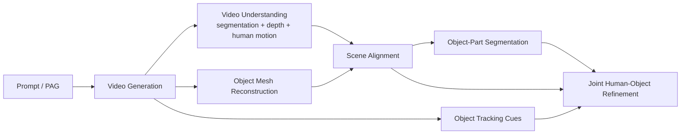

# 4DHOI

Modular 4D human-object interaction pipeline built around:
- PAG generation from text prompts,
- video generation,
- video and mesh segmentation,
- object mesh generation and alignment,
- human motion estimation with GVHMR,
- object part segmentation,
- object tracking,
- joint human-object refinement.

Every stage listed below is part of the intended 4DHOI pipeline.

1. turns a prompt into a structured interaction description,
2. generates a video of that interaction,
3. reconstructs the human and object geometry from that video,
4. aligns everything into one shared 3D scene,
5. segments object parts, tracks object motion, and refines the full interaction over time.

- `Generate_PAG/`: generate a Part Affordance Graph (PAG) JSON from prompts.
- `Generate_Video/`: generate a first frame and then a full video from the PAG.
- `Segment_Video/`: segment humans, objects, and object parts in the video.
- `Generate_Object_Mesh/`: reconstruct first-frame object meshes from masks.
- `Estimate_Depth/`: estimate depth for the generated video.
- `Estimate_Human_Motion/`: run GVHMR and export human meshes.
- `Align_Meshes/`: align first-frame meshes to scene depth and move the full
  human sequence into the aligned frame.
- `Segment_Object_Mesh/`: render aligned object meshes from multiple views and
  segment them into semantic parts.
- `Estimate_Optical_Flow/`: estimate per-object tracks with CoTracker or WAFT.
- `Track_Object_Mesh/`: optimize per-frame object `SE(3)` trajectories.
- `Track_Human_Object_Mesh/`: jointly refine human and object motion with PAG
  contact constraints, mask losses, and penetration losses.
- `Blender_Scripts/`: Blender import helpers for inspecting exported
  `.ply` / `.obj` frame sequences.
- `Conda_Environments/`: environment YAMLs used by the different stages.

## Current Code Flow



## Main Stages

| Stage | Main script(s) | Main inputs | Main outputs |
| --- | --- | --- | --- |
| PAG generation | `Generate_PAG/generate_pag.py` | `Generate_PAG/input_prompts/<video>/input_pag.json` | `Generate_PAG/output/<video>/output_pag_*.json` |
| First frame generation | `Generate_Video/generate_first_frame.py` | PAG JSON | `Generate_Video/output/<video>/first_frames/*.png` |
| Video generation | `Generate_Video/generate_video.py` | first frame, PAG JSON | `Generate_Video/output/<video>/*.mp4` |
| Video segmentation | `Segment_Video/segment_video.py` | generated video, PAG JSON | masks for humans, objects, and object parts, plus extracted `_frames/` under `Segment_Video/output/<video>/` |
| Object mesh generation | `Generate_Object_Mesh/generate_objects_meshes.py` | first-frame object masks, first-frame image | per-object meshes, poses, overlays, intrinsics under `Generate_Object_Mesh/output/<video>/` |
| Depth estimation | `Estimate_Depth/estimate_depth.py` | generated video | frame extraction, metric depth, relative depth when enabled, run summary under `Estimate_Depth/output/<video>/` |
| Human motion estimation | `Estimate_Human_Motion/estimate_human_motion.py` | generated video | GVHMR outputs under `Estimate_Human_Motion/output/<video>/` |
| Human mesh export | `Estimate_Human_Motion/export_human_motion_to_ply.py` | `hmr4d_results.pt` | `output_plys/frame_*.ply` |
| Mesh alignment | `Align_Meshes/align_meshes.py` | object meshes, first-frame human mesh, depth, masks | aligned meshes, `transforms.json`, overlays, summaries under `Align_Meshes/output/<video>/` |
| Full human sequence alignment | `Align_Meshes/align_human_motion_sequence.py` | `output_plys`, human entry in `transforms.json` | `Align_Meshes/output/<video>/human_motion_aligned/` |
| Object mesh part segmentation | `Segment_Object_Mesh/render_mesh_views.py`, `segment_renders.py`, `segment_meshes.py` | aligned object meshes, PAG, video part names | rendered multi-view RGB/face IDs, part masks, triangle labels, segmented meshes |
| Object track estimation | `Estimate_Optical_Flow/estimate_optical_flow_cotracker.py` or `estimate_optical_flow_waft.py` | video, frame-0 object masks | per-object tracks under `Estimate_Optical_Flow/output_*` |
| Object pose tracking | `Track_Object_Mesh/track_object_mesh.py` | aligned meshes, tracks, video masks, intrinsics | per-object `poses.json`, mesh sequence, overlays, debug metrics |
| Joint human-object refinement | `Track_Human_Object_Mesh/track_human_object_mesh.py` | aligned human sequence, tracked object poses, PAG, object-part labels, video masks | refined human meshes, refined object transforms, debug loss CSV/plots, overlay video |

## Recommended Run Orders

### Complete pipeline

1. `Generate_PAG/generate_pag.py`
2. `Generate_Video/generate_first_frame.py`
3. `Generate_Video/generate_video.py`
4. `Segment_Video/segment_video.py`
5. `Generate_Object_Mesh/generate_objects_meshes.py`
6. `Estimate_Depth/estimate_depth.py`
7. `Estimate_Human_Motion/estimate_human_motion.py`
8. `Estimate_Human_Motion/export_human_motion_to_ply.py`
9. `Align_Meshes/align_meshes.py`
10. `Align_Meshes/align_human_motion_sequence.py`
11. `Segment_Object_Mesh/render_mesh_views.py`
12. `Segment_Object_Mesh/segment_renders.py`
13. `Segment_Object_Mesh/segment_meshes.py`
14. `Estimate_Optical_Flow/estimate_optical_flow_cotracker.py` or
    `Estimate_Optical_Flow/estimate_optical_flow_waft.py`
15. `Track_Object_Mesh/track_object_mesh.py`
16. `Track_Human_Object_Mesh/track_human_object_mesh.py`

Use the generated optical-flow output directory from step 14 as the tracking
input for `Track_Object_Mesh/track_object_mesh.py`.

## Auxiliary Utilities

- `Estimate_Depth/convert_depth_to_pointcloud.py`
  - back-projects saved metric depth + intrinsics into a camera-space point
    cloud for debugging or visualization.
- `Blender_Scripts/import_ply_video_hierarchies_blender.py`
  - imports nested video output directories of `.ply` sequences into Blender.
- `Blender_Scripts/import_ply_seq_blender.py`
  - imports one flat `.ply` sequence into Blender.
- `Blender_Scripts/import_obj_seq_blender.py`
  - imports one flat `.obj` sequence into Blender.

## Important Data Conventions

### Human geometry

- GVHMR predicts SMPL-X parameters.
- `export_human_motion_to_ply.py` converts those to SMPL-space meshes with
  `6890` vertices using a fixed `smplx2smpl` matrix.
- The topology is fixed across frames, so the same SMPL vertex indices can be
  reused for part segmentation across the whole sequence.
- `Track_Human_Object_Mesh/track_human_object_mesh.py` uses:
  - aligned human meshes from
    `Align_Meshes/output/<video>/human_motion_aligned/`,
  - SMPL vertex groups from `smpl_vert_segmentation.json`.

### Why `human_motion_aligned` exists

- GVHMR outputs the human sequence in its own camera-frame geometry.
- `Align_Meshes/align_meshes.py` estimates `source_to_output_matrix_4x4`
  transforms that move assets into the aligned scene frame.
- `align_human_motion_sequence.py` applies the human transform to every human
  frame so that the whole human motion sequence lives in the same frame as the
  aligned object meshes.

### Object mesh part segmentation

`Segment_Object_Mesh/` is a three-step pipeline:

1. `render_mesh_views.py`
   - Blender renders each aligned object from multiple views.
   - Saves RGB renders and face-ID EXRs.
2. `segment_renders.py`
   - Uses Qwen-VL and SAM3 to segment part masks in those rendered views.
3. `segment_meshes.py`
   - Maps 2D part masks back to mesh triangles via face IDs and exports part
     labels and part meshes.

This stage is required for `Track_Human_Object_Mesh/track_human_object_mesh.py`
because the joint optimizer uses per-object part labels from
`*_triangle_labels.json`.

## Current Joint Refinement Stage

`Track_Human_Object_Mesh/track_human_object_mesh.py` currently performs joint
human-object refinement with:

- per-frame global human `SE(3)` corrections,
- per-frame object `SE(3)` deltas on top of tracked poses,
- one global uniform scale per object,
- PAG contact and contact-dynamics losses,
- SDF-based penetration losses,
- temporal smoothness,
- 2D bidirectional chamfer losses against human/object/part masks from
  `Segment_Video`.

It uses:

- aligned human meshes from `Align_Meshes/output/<video>/human_motion_aligned/`,
- tracked object outputs from `Track_Object_Mesh/` (often
  `output/<video>/`, but configurable via `--tracked_object_dir`),
- object part labels from `Segment_Object_Mesh/output/<video>/`,
- PAG JSON from `Generate_PAG/output/<video>/`,
- video masks from `Segment_Video/output/<video>/`.

## Environment Notes

The repo is split across multiple Conda environments:

- `Conda_Environments/4dhoi.yml`
  - general pipeline utilities,
  - video generation,
  - depth estimation,
  - alignment,
  - tracking/refinement utilities that do not depend on external repos.
- `Conda_Environments/gvhmr.yml`
  - GVHMR human motion estimation,
  - SMPL-X / SMPL export scripts.
- `Conda_Environments/sam3.yml`
  - SAM3-based video and rendered-view segmentation.
- `Conda_Environments/sam3d-objects.yml`
  - object mesh generation and related mesh tools.
- `Conda_Environments/waft.yml`
  - WAFT optical-flow tracking branch.

Exact package compatibility still depends on the sibling repos checked out next
to `4DHOI`, especially:

- `GVHMR/`
- `sam3/`
- `sam-3d-objects/`
- `Depth-Anything-3/`
- `WAFT/`

Additional runtime tooling used by parts of the flow:

- Blender 4.2 for `Segment_Object_Mesh/render_mesh_views.py` and the scripts in
  `Blender_Scripts/`
- `ffmpeg` for overlay / trail video exports in the tracking and refinement
  stages
- an OpenAI-compatible endpoint for `Generate_PAG/generate_pag.py`,
  `Segment_Video/segment_video.py`, and `Segment_Object_Mesh/segment_renders.py`

To refresh the checked-in environment YAMLs, run:

```bash
python Conda_Environments/export_envs.py
```

Useful variants:

```bash
python Conda_Environments/export_envs.py --env 4dhoi
python Conda_Environments/export_envs.py --env sam3 --env waft
python Conda_Environments/export_envs.py --drop-prefix
```

The exporter reads the live Conda envs named `4dhoi`, `gvhmr`, `sam3`,
`sam3d-objects`, and `waft`, then rewrites the matching YAMLs in
`Conda_Environments/`.

It also strips accidental local-only `sam-2` / `sam2` pip entries from the
generated YAMLs so the tracked environment files stay aligned with the current
SAM3-based pipeline.
