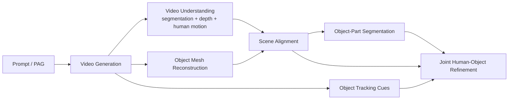

# 4DHOI

`4DHOI` is a modular pipeline for building 4D human-object interaction results
from a text prompt.

At a high level, the repo:

1. turns a prompt into a structured interaction description,
2. generates a video of that interaction,
3. reconstructs the human and object geometry from that video,
4. aligns everything into one shared 3D scene,
5. segments object parts, tracks object motion, and refines the full interaction over time.

## Pipeline Overview

## Main Stages

| Stage | Purpose | Main folders |
| --- | --- | --- |
| Interaction setup | Build a structured Part Affordance Graph (PAG) from prompts | `Generate_PAG/` |
| Video generation | Create a first frame and then a full video | `Generate_Video/` |
| Scene understanding | Segment the video, estimate depth, and recover human motion | `Segment_Video/`, `Estimate_Depth/`, `Estimate_Human_Motion/` |
| Object reconstruction | Build object meshes from the generated scene | `Generate_Object_Mesh/` |
| Alignment | Put the human and object assets into the same 3D coordinate frame | `Align_Meshes/` |
| Object processing | Label object parts and estimate object tracks | `Segment_Object_Mesh/`, `Estimate_Optical_Flow/`, `Track_Object_Mesh/` |
| Final refinement | Jointly refine human and object motion | `Track_Human_Object_Mesh/` |

## Typical Flow

1. Generate the PAG.
2. Generate the first frame and the video.
3. Segment the video.
4. Reconstruct object meshes.
5. Estimate depth.
6. Estimate human motion and export meshes.
7. Align the human and object assets into one shared frame.
8. Segment aligned object meshes into semantic parts.
9. Estimate object tracks from the video.
10. Track object poses over time.
11. Run joint human-object refinement.

Representative scripts:

- `Generate_PAG/generate_pag.py`
- `Generate_Video/generate_first_frame.py`
- `Generate_Video/generate_video.py`
- `Segment_Video/segment_video.py`
- `Generate_Object_Mesh/generate_objects_meshes.py`
- `Estimate_Depth/estimate_depth.py`
- `Estimate_Human_Motion/estimate_human_motion.py`
- `Estimate_Human_Motion/export_human_motion_to_ply.py`
- `Align_Meshes/align_meshes.py`
- `Align_Meshes/align_human_motion_sequence.py`
- `Segment_Object_Mesh/render_mesh_views.py`
- `Segment_Object_Mesh/segment_renders.py`
- `Segment_Object_Mesh/segment_meshes.py`
- `Estimate_Optical_Flow/estimate_optical_flow_cotracker.py`
- `Track_Object_Mesh/track_object_mesh.py`
- `Track_Human_Object_Mesh/track_human_object_mesh.py`

## Directory Guide

| Folder | What it contains |
| --- | --- |
| `Generate_PAG/` | prompt inputs and PAG generation |
| `Generate_Video/` | first-frame and video generation |
| `Segment_Video/` | human/object/part segmentation from video |
| `Generate_Object_Mesh/` | first-frame object mesh reconstruction |
| `Estimate_Depth/` | per-frame depth estimation |
| `Estimate_Human_Motion/` | human motion estimation and mesh export |
| `Align_Meshes/` | alignment into a shared scene frame |
| `Segment_Object_Mesh/` | object-part labeling on aligned meshes |
| `Estimate_Optical_Flow/` | object tracking cues from video |
| `Track_Object_Mesh/` | per-object motion tracking |
| `Track_Human_Object_Mesh/` | final joint refinement |
| `Conda_Environments/` | environment files for different stages |

## Inputs and Outputs

- Prompt inputs live in `Generate_PAG/input_prompts/<video_name>/`.
- Most stages write results to `output/<video_name>/` inside their own folder.
- Final refined outputs are typically under
  `Track_Human_Object_Mesh/output/<video_name>/`.

## Environment Notes

- Different stages use different Conda environments from
  `Conda_Environments/`.
- Some stages rely on sibling repositories such as `GVHMR/`, `sam3/`,
  `sam-3d-objects/`, `Depth-Anything-3/`, and `WAFT/`.
- Blender and `ffmpeg` are needed for some visualization and mesh-processing
  steps.
