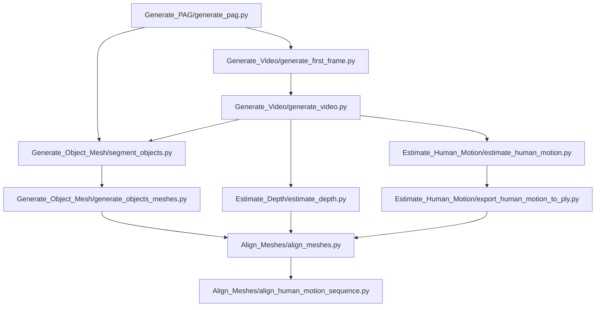

# 4DHOI

End-to-end 4D HOI pipeline built from modular stages (PAG, video generation, object mesh, depth, human motion, alignment), with optional branches for tracking and segmentation.

## Core Run Order

## Core Stages (What To Run After What)

1. `Generate_PAG/generate_pag.py`
2. `Generate_Video/generate_first_frame.py`
3. `Generate_Video/generate_video.py`
4. `Generate_Object_Mesh/segment_objects.py`
5. `Generate_Object_Mesh/generate_objects_meshes.py --mesh_format ply`
6. `Estimate_Depth/estimate_depth.py`
7. `Estimate_Human_Motion/estimate_human_motion.py`
8. `Estimate_Human_Motion/export_human_motion_to_ply.py`
9. `Align_Meshes/align_meshes.py`
10. `Align_Meshes/align_human_motion_sequence.py`

## Environment Notes

- `Generate_PAG`: Ollama/OpenAI client environment.
- `Generate_Video`, `Estimate_Depth`, `Align_Meshes`: `4dhoi` environment (with required libs installed).
- `Generate_Object_Mesh/segment_objects.py`: `sam3` environment.
- `Generate_Object_Mesh/generate_objects_meshes.py`: `sam3d-objects` environment.
- `Estimate_Human_Motion/estimate_human_motion.py`: `gvhmr` environment.
- `Estimate_Optical_Flow/estimate_optical_flow_waft.py`: `waft` environment.
